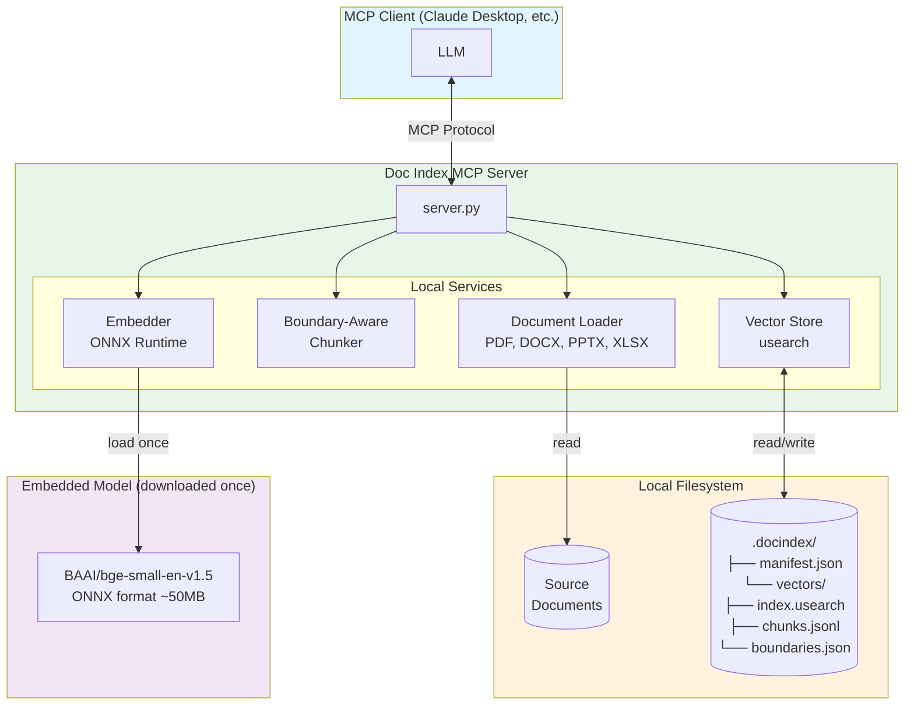
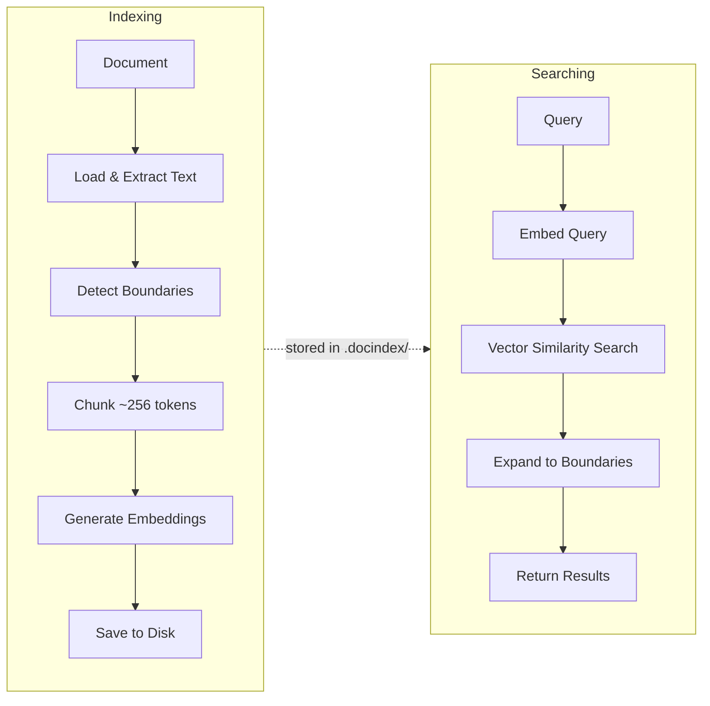

# Doc Index MCP

## What is This For?

A local-first semantic search server for your documents. Index PDFs, Word docs, PowerPoints, Excel files, and text/markdown, then search them using natural language via the Model Context Protocol (MCP).

- **Semantic search** - Find relevant content using natural language queries
- **Boundary-aware chunking** - Respects document structure (chapters, sections, headers)
- **Table extraction** - Extract tables from documents as CSV
- **Fully local** - No external APIs, no cloud services, no Docker containers, no PyTorch
- **Lightweight** - ONNX-based embeddings (~50MB vs ~2GB for PyTorch)

## Quick Start

### 1. Add to your MCP config

Requires [uv](https://docs.astral.sh/uv/getting-started/installation/). If you don't have uv, see [Alternative Installation](#alternative-installation) below.

Add to `.mcp.json` in your project root (for Claude Code) or your Claude Desktop config:

```json
{
  "mcpServers": {
    "doc-index": {
      "command": "uvx",
      "args": ["doc-index-mcp"]
    }
  }
}
```

### 2. Install the Claude skill (optional)

The skill teaches Claude how to use the search tools effectively (token budgets, boundary expansion, etc.):

```bash
uvx --from doc-index-mcp doc-index-install-skill
```

That's it — start asking Claude to index and search your documents.

## Supported Formats

| Format | Extensions | Notes |
|--------|------------|-------|
| Text | `.txt` | Plain text |
| Markdown | `.md`, `.markdown` | Preserves headers for boundaries |
| PDF | `.pdf` | Text extraction with page markers |
| Word | `.docx` | Paragraphs, headings, tables |
| PowerPoint | `.pptx` | Slides, notes, tables |
| Excel | `.xlsx`, `.xls` | Sheets as tables |

### Why No External Services?

| Component | Traditional RAG | This Server |
|-----------|-----------------|-------------|
| Embeddings | OpenAI API / hosted model | Local ONNX model (fastembed) |
| Vector DB | Pinecone / Weaviate / Qdrant | Local file (usearch) |
| Storage | Cloud / managed DB | Local `.docindex/` directory |
| Dependencies | PyTorch (~2GB) | ONNX Runtime (~50MB) |

## Tools

### `doc_index`
Index a document for semantic search.

```json
{
  "file_path": "docs/manual.pdf",
  "source_name": "manual"
}
```

### `doc_search`
Search indexed documents using natural language.

```json
{
  "query": "how to configure authentication",
  "top_k": 5,
  "expand_to_boundary": "section",
  "max_return_tokens": 4096
}
```

Parameters:
- `query` - Search query
- `sources` - Filter to specific sources (optional)
- `top_k` - Number of results (default: 5)
- `expand_to_boundary` - Expand results to full "chapter", "section", "subsection", or "page"
- `max_return_tokens` - Token budget for results (default: 4096)
- `include_siblings` - Include sibling sections when expanding

### `doc_list`
List all indexed sources.

### `doc_chunk`
Retrieve a specific chunk by ID with optional neighbors.

```json
{
  "chunk_id": "manual:42",
  "neighbors": 2
}
```

### `doc_toc`
Get the table of contents (chapters, sections, subsections) for an indexed document. Use this to understand document structure before retrieving specific content.

```json
{
  "source_name": "manual",
  "max_depth": 3
}
```

### `doc_get_content`
Retrieve document content by structural location. Provide exactly one locator: `boundary_id`, `chapter`, `section`, or `pages`.

```json
{
  "source_name": "manual",
  "chapter": "3",
  "max_return_tokens": 8192
}
```

### `read_document`
Read a document without indexing. Returns formatted text.

```json
{
  "file_path": "report.pdf",
  "max_chars": 100000
}
```

### `list_tables`
List all tables in a document.

```json
{
  "file_path": "data.xlsx"
}
```

### `extract_table`
Extract a specific table as CSV.

```json
{
  "file_path": "data.xlsx",
  "table_index": 0,
  "max_rows": 100
}
```

### Environment Variables

| Variable | Description | Default |
|----------|-------------|---------|
| `MCP_WORKING_DIR` | Base directory for resolving file paths | Current working directory |
| `DOC_INDEX_DIR` | Directory for storing vector indices | `.docindex` in working dir |

## Alternative Installation

### Install globally with pip

```bash
pip install doc-index-mcp
```

Then in your `.mcp.json`:

```json
{
  "mcpServers": {
    "doc-index": {
      "command": "doc-index-mcp"
    }
  }
}
```

### Install from source

Clone the repo and install dependencies:

```bash
git clone https://github.com/mike-anderson/doc-index-mcp.git
cd doc-index-mcp
pip install -e .
```

Then point your `.mcp.json` at the server entrypoint:

```json
{
  "mcpServers": {
    "doc-index": {
      "command": "python",
      "args": ["/path/to/doc-index-mcp/src/server.py"]
    }
  }
}
```

## Architecture

Everything runs locally - no external APIs, databases, or embedding servers required.



### Data Flow



## License

MIT
